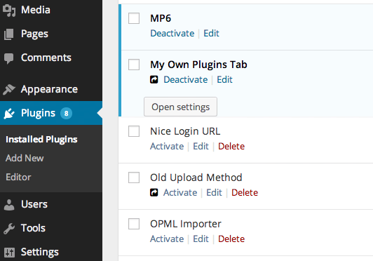
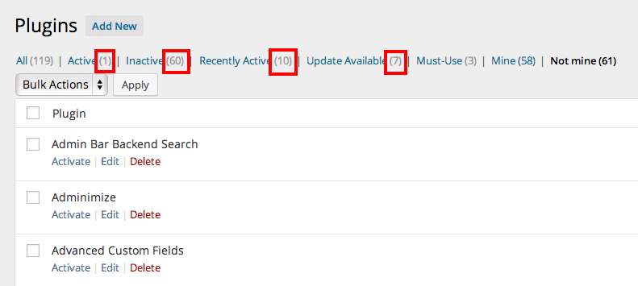

# [My Own Plugins Tab](https://github.com/brasofilo/My-Own-Plugins-Tab)
*Version 2013.10.17*

####*Separate your plugins from the others in the Plugins admin screen.*

**For developers**:  
see your plugins, and others', in separated tabs, quite useful when they start to count in dozens.

**For everybody**:  
simply add a comma-separated list of authors and you'll be able to sort the plugins in two groups.

----
***Icon marking my plugins***  

***Plugin settings***  

***When viewing our/their plugins, the marked counts reflect the screen being viewed***  

## FAQ
The plugin works in Multisite, but it's not under my control, further improvements needed.

## Changelog

Version 2013.10.14
* Plugin launch

## Credits
 - Uses [Font Awesome](http://fortawesome.github.io/Font-Awesome/), loaded from a [CDN](http://www.bootstrapcdn.com/#tab_fontawesome).

 - Plugin settings idea plugged from [WP Maintenance Mode](http://wordpress.org/plugins/wp-maintenance-mode/).

## Licence
Released under GPL, you can use it free of charge on your personal or commercial blog.